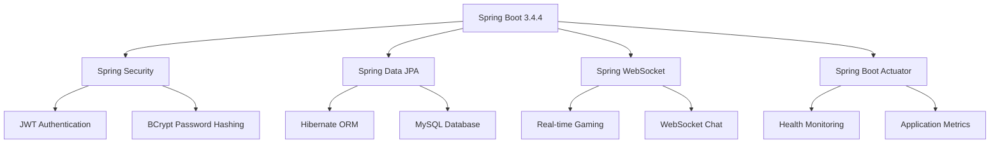
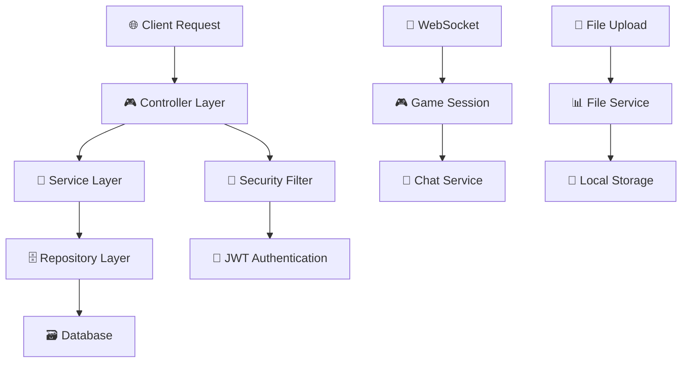

# QuizMe Backend 🧠

<div align="center">


**Một hệ thống backend mạnh mẽ cho ứng dụng quiz trực tuyến**

Được xây dựng với Spring Boot, hỗ trợ game quiz thời gian thực với WebSocket và quản lý phòng

[Demo](#) • [API Docs](#-api-documentation) • [Installation](#-cài-đặt) • [Contributing](#)

</div>

---

## 📋 Mục lục

- [🚀 Tính năng](#-tính-năng)
- [🛠 Công nghệ sử dụng](#-công-nghệ-sử-dụng)
- [⚡ Bắt đầu nhanh](#-bắt-đầu-nhanh)
- [📦 Cài đặt](#-cài-đặt)
- [⚙️ Cấu hình](#-cấu-hình)
- [🚀 Chạy ứng dụng](#-chạy-ứng-dụng)
- [📚 API Documentation](#-api-documentation)
- [📁 Cấu trúc dự án](#-cấu-trúc-dự-án)
- [🔧 Development](#-development)
- [🤝 Contributing](#-contributing)

---

## 🚀 Tính năng

| 👥 **Quản lý người dùng** | 📝 **Quản lý Quiz** | 🎮 **Game thời gian thực** | 🔧 **Tính năng khác** |
|---|---|---|---|
| ✅ Đăng ký/Đăng nhập | ✅ Tạo & chỉnh sửa quiz | ✅ Tạo & tham gia phòng | ✅ File upload |
| ✅ JWT Authentication | ✅ Phân loại danh mục | ✅ WebSocket real-time | ✅ Scheduled tasks |
| ✅ Refresh Token | ✅ Upload hình ảnh | ✅ Chat trong phòng | ✅ RESTful API |
| ✅ Quản lý hồ sơ | ✅ Quản lý câu hỏi | ✅ Theo dõi điểm số | ✅ Spring Security |
| ✅ Upload avatar | ✅ Quản lý đáp án | ✅ Game multiplayer | ✅ Health monitoring |

### ✨ **Highlights**

- 🔐 **Bảo mật cao** với JWT Authentication và Spring Security
- ⚡ **Real-time gaming** với WebSocket technology
- 📱 **RESTful API** hoàn chỉnh và documented
- 🎯 **Scalable architecture** với Spring Boot best practices
- 🖼️ **File management** system cho images và uploads
- 📊 **Monitoring** và health checks với Spring Actuator

---

## 🛠 Công nghệ sử dụng

<div>

### 🎯 **Core Technologies**

| **Category** | **Technology** | **Version** | **Purpose** |
|:---:|:---:|:---:|:---:|
| ☕ **Runtime** | Java | 21 LTS | Ngôn ngữ lập trình chính |
| 🌱 **Framework** | Spring Boot | 3.4.4 | Backend framework |
| 🔐 **Security** | Spring Security | Latest | Authentication & Authorization |
| 📊 **Database** | MySQL | 8.0+ | Primary database |
| 🔧 **Build Tool** | Maven | 3.6+ | Dependency management |

### 🏗️ **Spring Ecosystem**



### 📚 **Key Dependencies**

- **Lombok** - Giảm thiểu boilerplate code
- **Jackson** - JSON processing
- **Validation** - Input validation
- **DevTools** - Development productivity

</div>

---

## ⚡ Bắt đầu nhanh

> **TL;DR** - Muốn chạy ngay? Chỉ cần 3 bước đơn giản!

```bash
# 1️⃣ Clone project
git clone <repository-url> && cd QuizMe_Backend

# 2️⃣ Setup database
mysql -u root -p -e "CREATE DATABASE quizme_db;"

# 3️⃣ Run application
./mvnw spring-boot:run
```

🎉 **Xong!** Ứng dụng đã chạy tại [http://localhost:8080](http://localhost:8080)

---

## 📦 Cài đặt

### 📋 **Yêu cầu hệ thống**

<div>

| **Component** | **Version** | **Status** | **Download** |
|:---:|:---:|:---:|:---:|
| ☕ Java | 21+ | Required | [Download](https://openjdk.org/projects/jdk/21/) |
| 🔧 Maven | 3.6+ | Required | [Download](https://maven.apache.org/download.cgi) |
| 🗄️ MySQL | 8.0+ | Required | [Download](https://dev.mysql.com/downloads/) |
| 📁 Git | Latest | Required | [Download](https://git-scm.com/downloads) |

</div>

### 📥 **Cài đặt từng bước**

<details>
<summary><b>🔽 Nhấn để xem hướng dẫn chi tiết</b></summary>

#### **Bước 1: Clone repository**

```bash
# HTTPS
git clone <repository-url>
cd QuizMe_Backend

# SSH (nếu đã setup SSH key)
git clone git@github.com:username/QuizMe_Backend.git
cd QuizMe_Backend
```

#### **Bước 2: Cài đặt dependencies**

```bash
# Sử dụng Maven wrapper (khuyến nghị)
./mvnw clean install

# Hoặc sử dụng Maven global
mvn clean install
```

#### **Bước 3: Tạo thư mục uploads**

```bash
# Windows
mkdir uploads\category-icons uploads\profile-avatar uploads\question-images uploads\quiz-thumbnails

# Linux/Mac
mkdir -p uploads/{category-icons,profile-avatar,question-images,quiz-thumbnails}
```

</details>

---

## ⚙️ Cấu hình

### 🗄️ **Database Setup**

<details>
<summary><b>🔽 MySQL Configuration</b></summary>

#### **Tạo database**

```sql
CREATE DATABASE quizme_db CHARACTER SET utf8mb4 COLLATE utf8mb4_unicode_ci;

-- Tạo user riêng (tùy chọn, khuyến nghị cho production)
CREATE USER 'quizme_user'@'localhost' IDENTIFIED BY 'your_secure_password';
GRANT ALL PRIVILEGES ON quizme_db.* TO 'quizme_user'@'localhost';
FLUSH PRIVILEGES;
```

#### **Kiểm tra kết nối**

```bash
mysql -u root -p -e "SHOW DATABASES LIKE 'quizme_db';"
```

</details>

### 📄 **Application Configuration**

<details>
<summary><b>🔽 application.yml Configuration</b></summary>

Tạo file `src/main/resources/application.yml`:

```yaml
# Server Configuration
server:
  port: 8080
  servlet:
    context-path: /api

# Spring Configuration
spring:
  application:
    name: QuizMe_Backend
  
  # Database Configuration
  datasource:
    driver-class-name: com.mysql.cj.jdbc.Driver
    url: jdbc:mysql://localhost:3307/quizme_db?useSSL=false&serverTimezone=UTC&allowPublicKeyRetrieval=true
    username: root
    password: ""
    
  # JPA Configuration
  jpa:
    hibernate:
      ddl-auto: update
    show-sql: false
    properties:
      hibernate:
        dialect: org.hibernate.dialect.MySQL8Dialect
        format_sql: true
        
  # File Upload Configuration
  servlet:
    multipart:
      max-file-size: 10MB
      max-request-size: 10MB

# JWT Configuration
jwt:
  secret: your-secret-key-here
  expiration: 86400000 # 24 hours
  refresh-expiration: 604800000 # 7 days

# File Storage Configuration
file:
  upload-dir: uploads/

# Logging Configuration
logging:
  level:
    com.huy.quizme_backend: INFO
    org.springframework.security: DEBUG
  pattern:
    console: "%d{yyyy-MM-dd HH:mm:ss} - %msg%n"
```

</details>

### 🔐 **Environment Variables** (Production)

<details>
<summary><b>🔽 Environment Setup</b></summary>

Tạo file `.env` hoặc set environment variables:

```bash
# Database
DB_HOST=localhost
DB_PORT=3307
DB_NAME=quizme_db
DB_USERNAME=root
DB_PASSWORD=your_password

# JWT
JWT_SECRET=your-super-secret-jwt-key-here
JWT_EXPIRATION=86400000

# File Upload
UPLOAD_DIR=uploads/

# Server
SERVER_PORT=8080
```

</details>

---

## 🚀 Chạy ứng dụng

### 🏃‍♂️ **Development Mode**

```bash
# Sử dụng Maven wrapper (khuyến nghị)
./mvnw spring-boot:run

# Với hot reload (auto-restart)
./mvnw spring-boot:run -Dspring-boot.run.profiles=dev

# Hoặc sử dụng Maven global
mvn spring-boot:run
```

### 📦 **Production Build**

```bash
# Build JAR file
./mvnw clean package -DskipTests

# Chạy JAR file
java -jar target/QuizMe_Backend-0.0.1-SNAPSHOT.jar

# Với custom profile
java -jar -Dspring.profiles.active=prod target/QuizMe_Backend-0.0.1-SNAPSHOT.jar
```

### 🐳 **Docker Support** (Tùy chọn)

<details>
<summary><b>🔽 Docker Configuration</b></summary>

Tạo `Dockerfile`:

```dockerfile
FROM openjdk:21-jdk-slim

WORKDIR /app

COPY target/QuizMe_Backend-0.0.1-SNAPSHOT.jar app.jar

EXPOSE 8080

ENTRYPOINT ["java", "-jar", "app.jar"]
```

Tạo `docker-compose.yml`:

```yaml
version: '3.8'
services:
  app:
    build: .
    ports:
      - "8080:8080"
    depends_on:
      - mysql
    environment:
      - SPRING_DATASOURCE_URL=jdbc:mysql://mysql:3306/quizme_db
      - SPRING_DATASOURCE_USERNAME=root
      - SPRING_DATASOURCE_PASSWORD=rootpassword

  mysql:
    image: mysql:8.0
    environment:
      - MYSQL_ROOT_PASSWORD=rootpassword
      - MYSQL_DATABASE=quizme_db
    ports:
      - "3306:3306"
    volumes:
      - mysql_data:/var/lib/mysql

volumes:
  mysql_data:
```

Chạy với Docker:

```bash
docker-compose up -d
```

</details>

### ✅ **Kiểm tra ứng dụng**

Sau khi khởi động thành công:

- 🌐 **API Base URL**: [http://localhost:8080](http://localhost:8080)
- 📊 **Health Check**: [http://localhost:8080/actuator/health](http://localhost:8080/actuator/health)
- 📋 **API Info**: [http://localhost:8080/actuator/info](http://localhost:8080/actuator/info)

---

## 📚 API Documentation

### 🔐 **Authentication Endpoints**

<details>
<summary><b>🔽 Auth API Details</b></summary>

| Method | Endpoint | Description | Request Body |
|:---:|:---:|:---:|:---:|
| `POST` | `/api/auth/register` | Đăng ký tài khoản | `{username, email, password}` |
| `POST` | `/api/auth/login` | Đăng nhập | `{username, password}` |
| `POST` | `/api/auth/refresh-token` | Làm mới JWT token | `{refreshToken}` |
| `POST` | `/api/auth/logout` | Đăng xuất | `Authorization: Bearer <token>` |

**Example Request:**

```bash
curl -X POST http://localhost:8080/api/auth/login \
  -H "Content-Type: application/json" \
  -d '{"username": "testuser", "password": "password123"}'
```

</details>

### 👤 **User Management**

<details>
<summary><b>🔽 User API Details</b></summary>

| Method | Endpoint | Description | Auth Required |
|:---:|:---:|:---:|:---:|
| `GET` | `/api/users/profile` | Lấy thông tin profile | ✅ |
| `PUT` | `/api/users/profile` | Cập nhật profile | ✅ |
| `POST` | `/api/users/avatar` | Upload avatar | ✅ |

</details>

### 📝 **Quiz Management**

<details>
<summary><b>🔽 Quiz API Details</b></summary>

| Method | Endpoint | Description | Auth Required |
|:---:|:---:|:---:|:---:|
| `GET` | `/api/quizzes` | Lấy danh sách quiz | ❌ |
| `POST` | `/api/quizzes` | Tạo quiz mới | ✅ |
| `GET` | `/api/quizzes/{id}` | Lấy chi tiết quiz | ❌ |
| `PUT` | `/api/quizzes/{id}` | Cập nhật quiz | ✅ |
| `DELETE` | `/api/quizzes/{id}` | Xóa quiz | ✅ |

</details>

### ❓ **Question Management**

<details>
<summary><b>🔽 Question API Details</b></summary>

| Method | Endpoint | Description | Auth Required |
|:---:|:---:|:---:|:---:|
| `GET` | `/api/questions/quiz/{quizId}` | Lấy câu hỏi của quiz | ❌ |
| `POST` | `/api/questions` | Tạo câu hỏi mới | ✅ |
| `PUT` | `/api/questions/{id}` | Cập nhật câu hỏi | ✅ |
| `DELETE` | `/api/questions/{id}` | Xóa câu hỏi | ✅ |

</details>

### 🏠 **Room & Game Management**

<details>
<summary><b>🔽 Room & Game API Details</b></summary>

| Method | Endpoint | Description | Auth Required |
|:---:|:---:|:---:|:---:|
| `GET` | `/api/rooms` | Lấy danh sách phòng | ✅ |
| `POST` | `/api/rooms` | Tạo phòng mới | ✅ |
| `POST` | `/api/rooms/{id}/join` | Tham gia phòng | ✅ |
| `DELETE` | `/api/rooms/{id}/leave` | Rời phòng | ✅ |

</details>

### 🔌 **WebSocket Endpoints**

| Endpoint | Description | Protocol |
|:---:|:---:|:---:|
| `/ws/game` | Game WebSocket connection | WebSocket |
| `/ws/chat` | Chat WebSocket connection | WebSocket |

### 📊 **Response Format**

```json
{
  "success": true,
  "message": "Operation successful",
  "data": {
    // Response data here
  },
  "timestamp": "2025-06-08T10:30:00Z"
}
```

---

## 📁 Cấu trúc dự án

<details>
<summary><b>🔽 Xem cấu trúc chi tiết</b></summary>

```
QuizMe_Backend/
├── 📁 src/
│   ├── 📁 main/
│   │   ├── 📁 java/com/huy/quizme_backend/
│   │   │   ├── 📁 config/          # 🔧 Spring configurations
│   │   │   ├── 📁 controller/      # 🎮 REST Controllers
│   │   │   ├── 📁 dto/            # 📊 Data Transfer Objects
│   │   │   ├── 📁 entity/         # 🗃️ JPA Entities
│   │   │   ├── 📁 exception/      # ❌ Exception handling
│   │   │   ├── 📁 repository/     # 🗄️ JPA Repositories
│   │   │   ├── 📁 security/       # 🔐 Security configurations
│   │   │   ├── 📁 service/        # 💼 Business logic
│   │   │   ├── 📁 session/        # 🔌 WebSocket sessions
│   │   │   ├── 📁 util/           # 🛠️ Utility classes
│   │   │   └── 📄 QuizMeApplication.java
│   │   └── 📁 resources/
│   │       ├── 📄 application.yml # ⚙️ Configuration
│   │       ├── 📁 sql/           # 🗃️ Database scripts
│   │       └── 📁 static/        # 📊 Static resources
│   └── 📁 test/                  # 🧪 Unit tests
├── 📁 uploads/                   # 📁 File uploads
│   ├── 📁 category-icons/
│   ├── 📁 profile-avatar/
│   ├── 📁 question-images/
│   └── 📁 quiz-thumbnails/
├── 📁 target/                    # 🎯 Build output
├── 📄 pom.xml                   # 📦 Maven dependencies
├── 📄 README.md                 # 📖 This file
├── 📄 mvnw                      # 🔧 Maven wrapper (Unix)
└── 📄 mvnw.cmd                  # 🔧 Maven wrapper (Windows)
```

</details>

### 🏗️ **Architecture Overview**



---

## 🔧 Development

### 🧪 **Testing**

```bash
# Chạy tất cả tests
./mvnw test

# Chạy tests với coverage report
./mvnw test jacoco:report

# Chạy tests cho specific package
./mvnw test -Dtest=com.huy.quizme_backend.service.*

# Chạy integration tests
./mvnw test -Dtest=**/*IntegrationTest
```

### 🏗️ **Build Commands**

```bash
# Development build
./mvnw clean compile

# Production build (skip tests)
./mvnw clean package -DskipTests

# Build with tests
./mvnw clean package

# Install to local repository
./mvnw clean install
```
---
